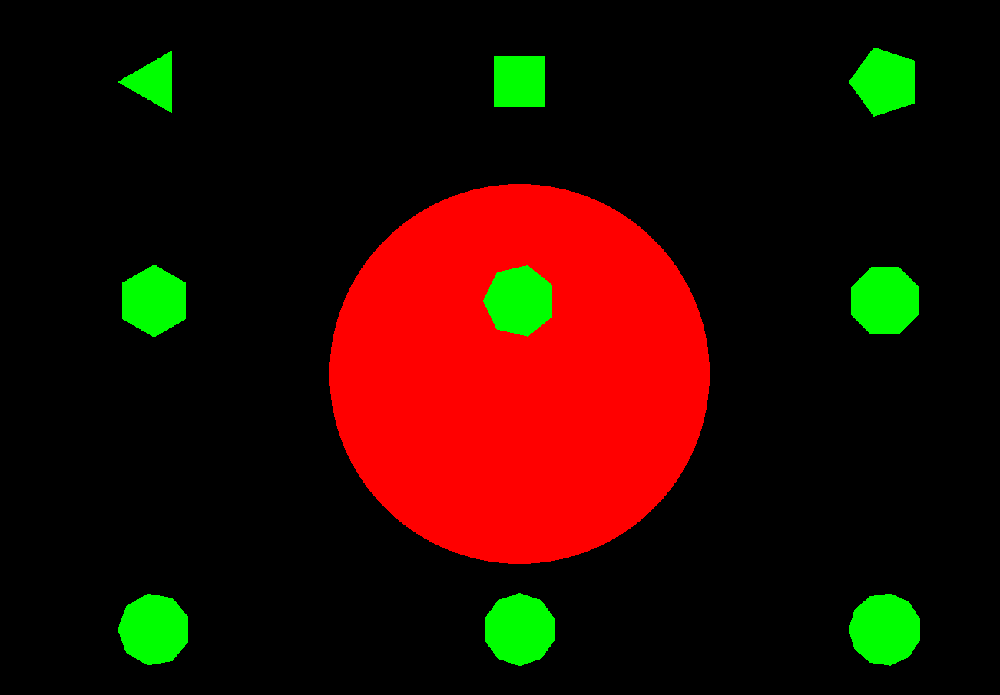

# Drawing Polygons using GLUT with simple Math

Main concept relys on that regular polygons usually consists of many triangles depends on number of polygon sides.

# Sample from Code output (polygons from 3 - 11 side).

	it is easy to make a circle using this function by supplying large number of sides,
	(more sides gives more smoothing).

