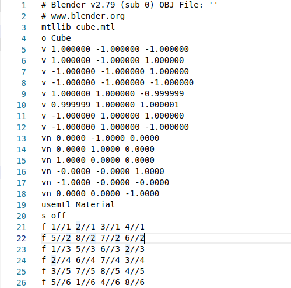
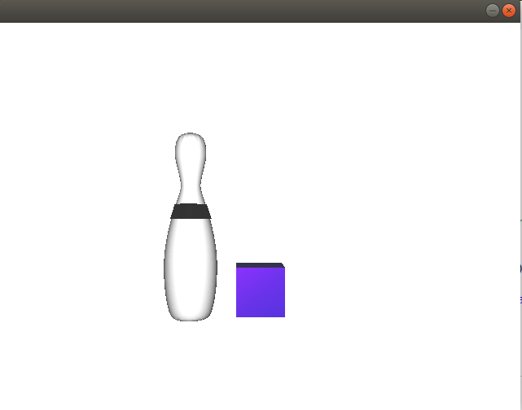

## Installation

you will nedd to install SDL i am using here SDL not SDL2 

`$  sudo apt-get install libsdl1.2-dev`

## Run

`$ g++ -std=c++14 run.cpp -lSDL -lGL -lGLU; ./a.out`

## Small tutorial

this is a small tutorial explainig how the code works! 

it mainly divided into 2 main sections:

1) load 2d object and extracting the information to start working on it 
    
    before getting deep into code; we have to know the construction of the file 
    having a cube example as a 3d object 
    
    
    we have all vertices listed (8 vertices)
    then all normal vectors for each face/polygon (6 faces for cube)
    then we have the faces it self with 4 or three vertex depending on the shape,
    taking the format vertex // normal / texture seperated with spaces for each vertex..
    
    and we also have mtllip followed by the material file which saves all materials data used for this object.
    
    and usemtl followed by material name is for using material and applying it for all followed faces till use another one.
    
    Code doesn't differ too much it just implement the previous cases through multiple if else conditions...
    
2) second section of the code is to draw all vertices extracted to format our faces depending on the data collected with it's materials and textures..
    
    
for using it on your app all you have to do is to include "object_3d.cpp" on your app

`$ include "object_3d.cpp" `

then get a refrence for abject by calling function load and save the value returned from it(the object list number)

`$ objloader obj_3d;`
`$ int cube = obj_3d.load("cube.obj");`

*note: it is prefered to initialize loading oof the object in the init function.

then whenever you want to render your object just call function glCallList(object_name); 

`$ glCallList(cube);`

that's all.

thanks for reading, for any issues feel free to contact me on my email "hu.sa8669@gmail.com".

references:
    https://www.youtube.com/watch?v=FhQBsV-zdqI&list=PLqicapcDKPwrcIBcgyopmiS2Rp6bVyPBO
    
    tutorial 8 and 12.
    

## Output Examlpe

## License
[MIT](https://choosealicense.com/licenses/mit/)
